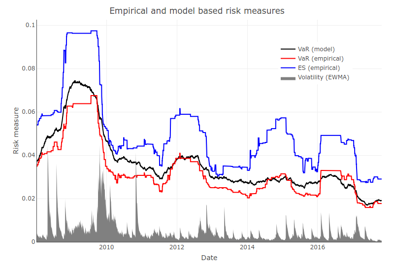

# Abstract

In this report we briefly demonstrate the behaviour of the value-at-risk and
expected shortfall for the closing prices of Amazon equities from 2008 to 
present day. We find that the model based value-at-risk is a more conservative
risk measure with a lower level of fluctuation which would 
likely be more suitable for use than the corresponding empirically calculated 
value.

# Introduction

We define our losses as being described by some process $X$, where for some percentile
$\alpha \in (0, 1)$ we define the *value-at-risk* 
$\textrm{VaR}_\alpha(X) = \inf_l \{l \colon \mathbb{P}(X \geq l) \leq 1-\alpha \}$.
Additionally we define the *expected shortfall* 
$\textrm{ES}_\alpha(X) = \tfrac{1}{1-\alpha} \int_\alpha^1 \textrm{VaR}_u(X) \dd{u}$ \citep[page 88]{yamai2002comparative}. 
With these definitions we notice that we would anticipate the value-at-risk and 
expected shortfall to be positive quantities for most reasonable portfolios 
which carry a risk of loss. (Common choices for $\alpha$ include 0.95 and 0.99).
For a more extended treatment and definition of these risk measures we 
recommend the reader to \citet[p.~88]{yamai2002comparative}.

# Empirical performance

We track the two risk measures in \Cref{fig:var_and_es} for the Amazon (AMZN) equity,
where value-at-risk is 
both empirically calculated and also calculated from its theoretical model by having
a $t$-distribution fitted (with 3 degrees of freedom, estimated using the MLE). 
Empirical estimates were computed over a 1 year interval (approximately 256 trading days).

{width=520px}

We can make several observations:  

1. The estimated shortfall appears to be appreciably larger (between 10--30% typically)
than value-at-risk, so is a more conservative risk measure.  
2. The empirical and fitted estimates for the value-at-risk closely track each other, although
the fitted value is typically marginally larger than the empirically estimated value.  
3. The fitted value-at-risk shows a smaller degree of fluctuation than the empirical values. This is 
particularly clear at discontinuous regions, such as early 2016.  

Additionally, we can see that all the risk measures appear to capture the times of increased volatility, 
most appreciably the 2008 financial crisis (which appears notably between 2009 and 2010). Since then there
have not been as notable or distinguished events. 


# Conclusions

Based on the results of the risk-measures as assessed on Amazon stock prices, we have seen that the empirically calculated values and model based fitted values for the value-at-risk are largely interchangeable. Practically, it may be more favourable to use the fitted values from the model based approach as these 
demonstrated less discontinuous behaviour compared to the empirically fitted value. This "smoother" behaviour
would likely be better suited as a trading based risk measure, where it is favourable to reduce turnover costs. If a more conservative risk measure is required, then the expected shortfall may be more desirable, depending on the appropriate risk requirements for investing. 

\clearpage

# Code

The following code computed the various value-at-risk and empirical shortfalls estimates:

```{r, eval=FALSE}
# Author: Sam Cohen, October 2017. (Adapted by Oliver Sheridan-Methven)
library("quantmod")
library("MASS")
getSymbols("AMZN", src = "google")  # Looking at Amazon.
ret <- -diff(log(coredata(AMZN$AMZN.Close)))  # Considering 'losses'

mean <- 0
spread <- 0
Evar <- 0  # Empirical expected VaR.
EES <- 0  # Empirical expected shortfall.
Mvar <- 0  # Model-based VaR.
MES <- 0  # Model-based expected shortfall.
alpha <- 0.95  # The top 5-th percentile.
year_length <- 256  # Number of trading days per year (approximately).

for (i in 1:(length(ret) - year_length)) {
  x <- ret[i:(i + year_length)]
  Evar[i] <- quantile(x, alpha)
  EES[i] <- mean(x[x > quantile(x, alpha)])
  param <- fitdistr(x, 't', df = 3)$estimate
  mean[i] <- param[1]
  spread[i] <- param[2]
  Mvar[i] <- mean[i] + spread[i] * qt(alpha, df = 3)
}
```

# References